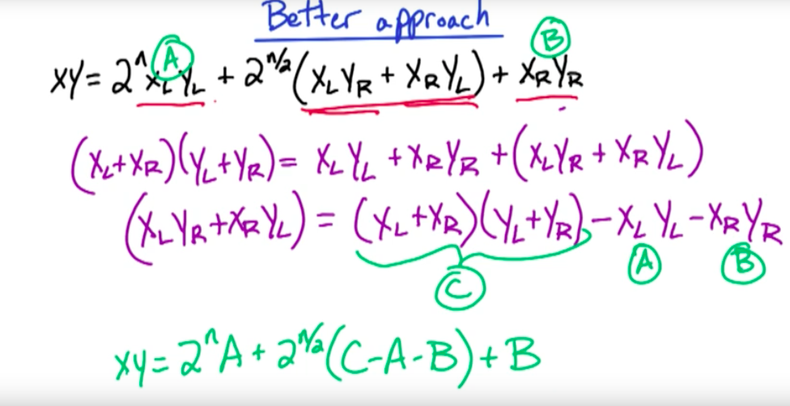
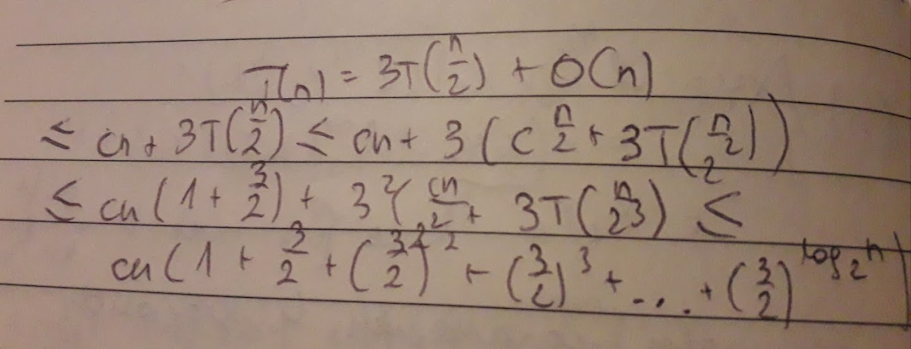
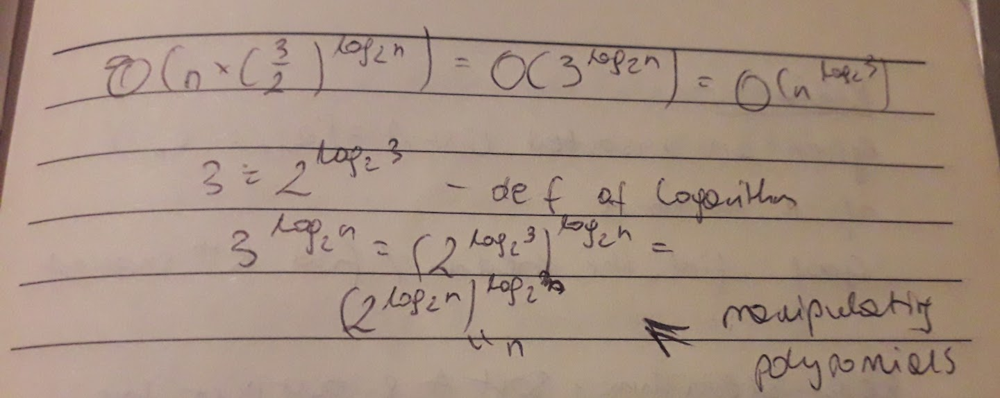

**Divide and Conquer**

*Gauss's idea*

Setting: multiplication is expensive

Adding/ substracting is cheap

a,b,c,d - real numbers; b~i~, d~i~ - imaginary numbers

2 complex numbers: a+ b~i~, c+ d~i~

(a+b~i)(c+d~i~) = ac - bd + (bc+ad)i

(a+b)(c+d) = ac + bd

(bc + ad) = (a+b)(c+d) - ac -bd

(a+b)(c+d) - simpler numbers than complex numbers

The idea is to replace multiplication with more additions/ subsractions,
now we only need 3 miltiplications

*D&C easy approach*

Input: n-bit integers x & y, assume n is a power of z

Goal: Compute z = xy

D&C idea: Break input into 2 halves - first n/2 bits and last n/2 bits

x = 182 = (10110110)

x~L~ = (1011)~L~ = 11

x~R~ = (0110)~R~ = 6

xy = (2^n/2^x~L~ + x~R~)(2^n/2^y~L~ + y~R~) = 2^n^x~L~y~L~ +
2^n/2^(x~L~y~R~ + x~R~y~L~) + x~R~y~R~

To recursively compute all 4 subproducts : 4T(n/2)

Let T(n) = worst case running time of EasyMultiply of input size n

*Recurrence*

T(n) = 4T(n/2) + O(n) = 0(n^2^)

**Better approach**

Running time

**Pseudocode (Fast Multiply)**

Input: n-bit integers x & y, n = 2^k^

Output: z = xy

x~L~ = 1st n/2 bits of x

x~R~ = last n/2 bits of x

y~L~ = 1st n/2 bits of y

y~R~ = last n/2 bits of y

A = Fast Multiply(x~L~, y~L~), B = Fast Multiply(x~R~, y~R~), C = Fast
Multiply(x~L~ + x~R~, y~L~ + y~R~)

Z = z^n^A + Z ^n/2^(C-A-B) + B

Return Z