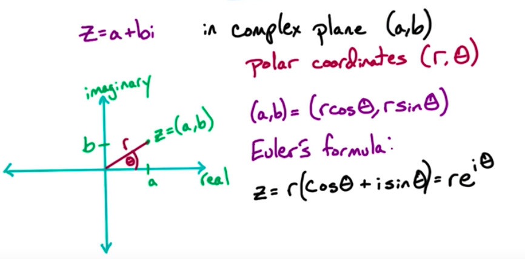

**Solving Recurrences**

T(n) = 4T(2/n) + O(n)

For some constant c >0, T(n)<= T(n/2) + cn, T(1) <=c

T(n)<=cn+ 4T(n/2) <= cn + 4[ 4T(n/n^2^) + cn/2] = cn (1+ 4/2) +
4^2^T(n/2^2^) <= cn(1+4/2) + 4^2^[4T(n/2^3^) + c(n/2^2^)] = cn (1+
(4/2)+ (4/2)^2^ + 4^3^T(n/2^3^) <= cn(1+ (4/2) + (4/2)^2^ + .. +
(4/2)^i-1^) + $T(n/2^i^) <= cn(1+ (4/2) + (4/2)^2^ + .. +
(4/2)^log~2~n-1^) + 4^log~2~n^T(1) = O(n) +O((4/2)^log~2~n^) +O(n^2^) =
)O(n)+ O(n) + O(n^2^) = O(n^2^) (last term dominates because >1)

(We want the last expression to be our base time and equal 1)

Let i = log~2~n (2 is the abse because denominator in equasion was 2)

Then 2/2^i^ = 1

*Geometric series*

1 + α + α^2^ + ... + α^k^   ---> Which dominates?

 - 0(α^k^) if α >1
 - O(k) if α = 1
 - O(1) if α < 1

*Manupulating polynomials refresher*

4^log~2~n^ = n^2^

3^log~2~n^ = n^c^

3^log~2~n^ = (2^log~2~3^)^log2n^ = (2^log~2~n^)^log23^ = n^log~2~3^

c = log~2~3

**General recurrence**

Constants a >0, b >1

T(n) = aT(n/b) + O(n)

T(n) = cn(1+ (a/b) + (a/b)^2^ + .. + (a/b)^logb(n-1)^ + a ^logbn^T(1) =

- O(n^logba^) if a > b
- O(n x logn) if a = b
- O(n) if a <b

*(logba = log a a with base b)

*Complex numbers*

