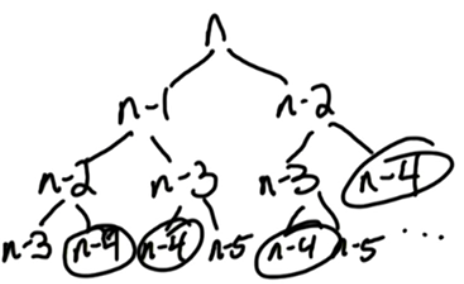

**Fibonacci**

F~0~ = 0; F~1~ = 1

For n >1: Fn = F~n-1~ + F~n-2~

Input: integer n >=0
Output: nth Fibonacci number

Fibonacci numbers grown exponentially by ɸ (phi) = (1+ √5)/2 ~ 1.618

This is known as a 'golden ratio.

*Naive algorithm Fib1*

If n= 0, return 0
if n =1 , return 1

Return Fib1(n-1) + Fib1(n-2)

Let T(n) = number of steps for Fib1(n)

T(n) <= O(1) + T(n-1) + T(n-2)
T(n) >= Fn ~ 1.618

Why is this algorithm inefficient?

We are recomputing identical problems many times!

Better solution Fib2(n)

F[0] = 0
F[1] = 1

O(1)

For  i: 2-> n
F[i] = F[i-1] + F[i-2]

O(n)

Total running time O(n)

