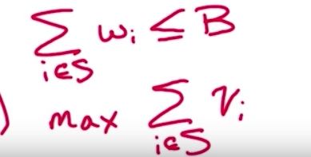

**Knapsack**

- N objects with integer weights w~1~...w~n~ and integer values v~1~...v~n~
- Total capacity B

Goal: Find subset S of objects that

1. Fits in the backpack
2. Maximises value

Two versions of the problem
- Each object can ony be used once
- Each object can be used multiple times

For i & b where 0 <= i <= n & 0 <=b <=B

If w~i~ <= b

then K(i,b) = Max { v~i~ + k(i-1, b-w~i~), k(i-1, b)

else k(i,b) = k(i-1, b)

Bases cases

K(0,b) = 0; K(i, b) = 0

*Pseudo code*

For b:0-> B: K(0, b) = 0

For i:1->n  K(i,0) = 0

For i L 1-> n

&nbsp;&nbsp;&nbsp;&nbsp;For b: 1-> B

&nbsp;&nbsp;&nbsp;&nbsp; If w~i~ <= b then K(i,b) = max { v~1~ + k(i-1,
b-w~i~), k(i-1, b)}

&nbsp;&nbsp;&nbsp;&nbsp;else k(i,b) = k(i-1, b)

return K(n, B)

Time complexity O(nB) --> it is NOT polynomial in the input size because
of B

Time to store B in memmpory - log(B)

The knapsack problem is NP-complete: cannot be solved in polynomial time
in any known way

(NP = non-deteministic polynomial time)

2. **Knapsack v2 (allowed used objects multiple times)**

K(i,b) = max { K(i-1, b), v~1~+ K(i, b-w~i~)

K(i-1, b) --> no more copies of Object i

K(i, b-w~i~) --> in V~1~ this was i-1, another copy of object i

But we don't really need parameter i anymore - since we are allowed to
use objects multiple times, we don't need to keep tract of it

For b where 0 <= b <= B

K(b) = max value attainable using weight <=b

Recurrence: try all posibilities for last object to add

K(b) = max { v~1~ + k(b-w~i~): 1<=i<=n, w~i~ <=b

*Pseudocode*

For b:0-> B

K(b) = 0

S(b) = 0

&nbsp;&nbsp;&nbsp;&nbsp;For i:1-> n O(B)

&nbsp;&nbsp;&nbsp;&nbsp; If w~i~ <=b & k(b) < v~i~ + k(b-w~i~) then k(b)
= v~i~ + k(b-w~i~); S(b) = i O(n)

return K(B)

**O(nB)**

