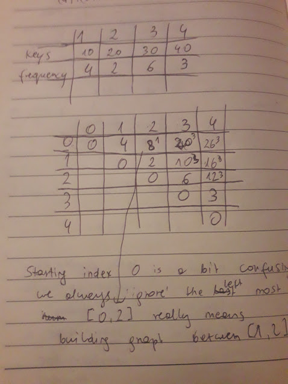

**Optimal Binary Search Tree**

Binary Search Tree is a node-based binary tree data structure which has the following properties:

- The left subtree of a node contains only nodes with keys lesser than
the node’s key.
- The right subtree of a node contains only nodes with keys greater than
  the node’s key.
- The left and right subtree each must also be a binary
  search tree.

*Reminder*

Factorial - product of all the numbers from n down to 1

(n-1)x(n-2)x...x2x1

Catalan numbers

C~n~ = (2n!)/(n+1)!n! --> total possible combinations for binary search
tree (NOT binary tree in general)

For example, for n=3

(2x3)!/4!3! = (6x5x4x3x2)/(4x3x2x3x2)= 5

*Example*

