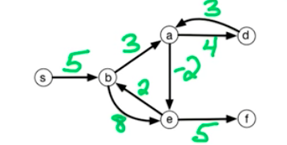
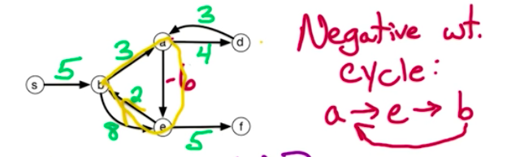
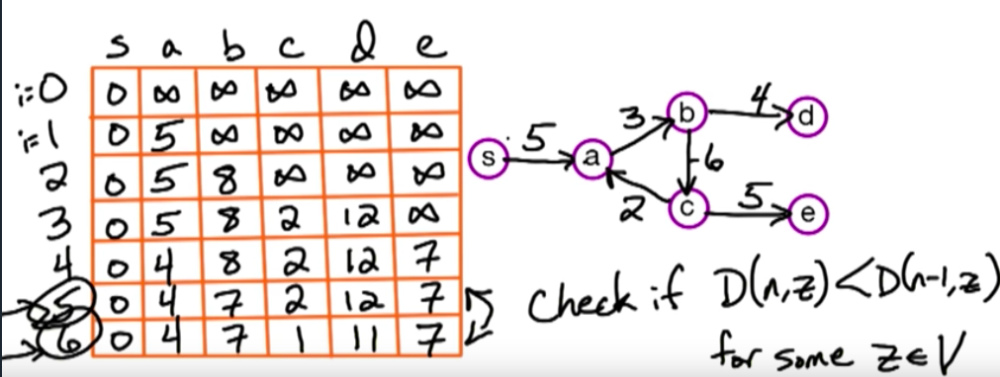
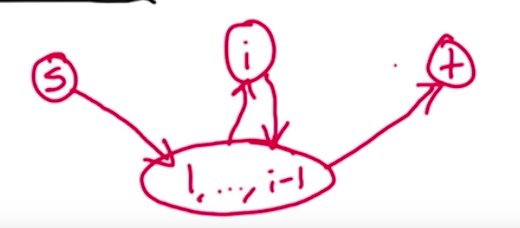

**Shortest Paths**

We have a directed graph G=(V,E) with edge weights w(e)

We pick a starting point s∈V and aim to calculate shortest paths from s
to any other point z∈V in the graph (the solution is the array of
numbers)

For z ∈ V, dist(z) = length of shortest path from s to z

dist(s) = 0
dist(b) = 5
dist(a) = 8
dist(e) = 6

It's a directed graph because arrows have directions. But we could
easily 'collapse' them and solve a generalised problem of undirected graphs

Dijkstra's algorithm: Given G and s∈V, fnd dist(z) for all z∈V

Dijkstra's algorithm usually works in O(n+m)log(n) time; where n =
number of vertices and m = number of edges

BUT doesn't work is some of the edge weights are negative

**Negative weight cycle**

Going through the cycle shortens our walk to optimal would be to go
infinite amount of times

Therefore, if negative weight cycle exists, problem is not well defined.

We refactor the problem:
 - Find a negative weight cycle if one exists
- Else: find dist(z) for all z∈V

Negative cycles only exist for walks (we are allowed to repeat which
vertices we walk), not for paths (each vertex once)

*Recurrence*

For 0<= i<= n-1 & z∈V let D(i,z) = length of shortest path from s to z
using <= i edges

Base case: D(0,s) = 0 & for all z!=s D(0,z) = Infinity

What if we look at using exactly i edges:

To recap, if using AT MOST i edges,

D(i,z) = min{D(i-1,z), min[over y]{D(i-1,y)+w(y,z)}}

D(i-1,z)--> becaue we don't have to use exactly i edges

min[over y]{D(i-1,y)+w(y,z)}--> Pick y when this sum is the smallest

*Pseudocode* Bellman-Ford (G,s,w)

For all z∈V, D(0,z) = Infinity, D(0,s) = 0

For i:1-> n-1

&nbsp;&nbsp;&nbsp;&nbsp;For all z∈V

&nbsp;&nbsp;&nbsp;&nbsp;D(i,z) = D(i-1, z)

&nbsp;&nbsp;&nbsp;&nbsp;&nbsp;&nbsp;&nbsp;&nbsp;For all y∈E (y which
have vertex to z) **

&nbsp;&nbsp;&nbsp;&nbsp;&nbsp;&nbsp;&nbsp;&nbsp;If D(i,z) > D(i-1, y) +
w(y,z) then D(i,z) = D(i-1,y)+ w(y,z)

(Loop over all vertices - and edges to a given vertex--> total of all edges)

Return D(n-1, ·) --> we return an array, the last row of the 2D table

**Here we are looking at all edges INTO z. To do that, we need to
construct a reversed graph (takes O(n+m) time) and look at the list of
edges out of z

O(mn) time in total

But...what about negative weight cycles?

**Variation: All-pairs shortest path**

Given G=(V,E) with edge weight w(e)

For y,z ∈V let dist(y,z) = length of shortest path from y to z

Goal: Find dist(y,z) for all y,z∈V

Easy solution: Run Bellman-Ford algorithm for all s∈V --> O(mn^2^)

*Another algorithm idea (all pairs)*

Let V = {1,2,...,n}

Condition on intermediate vertices --> use prefix of V

FOr 0<=i<=n & 1<= s (start vertex), t (end vertex)<=n

Let D(i,s,t) = length of shortest path s->t using a subset of {1,....i}
as intermediate vertices

*Recurrence*

For 0<=i<=n & 1<=s, t<=n

Let D(i,s,t) = length of shortest path s->t using a subset of {1,....i}
as intermediate vertices

Base case: D(0,s,t) = { w(s,t) if st∈E (if st have directed edge); false
otherwise

For i >=1 look at shortest path Ps->t using {1, ...i}

If i∉P D(i,s,t) = D(i-1,s, t)

If i∈P (i id on the path)

s --> subset of { 1, ...i} --> i --> subset of {1,...i-1}--> t

D(i,s,t) = D(i-1,s,i) + D(i-1, i, t)

D(i,s,t) = min {D(i-1,s,t), D(i-1,s,i) + D(i-1,i,t} (i=0->n)

*Pseudocode (Floyd-Warshall) (G, w)*

For s=1->n

&nbsp;&nbsp;&nbsp;&nbsp;For t=1->n

&nbsp;&nbsp;&nbsp;&nbsp;If st∈E then D(0,s,t) = w(s,t) (if it is an
edge)

&nbsp;&nbsp;&nbsp;&nbsp;Else D(0,s,t) = Infinity

For i=1->n

&nbsp;&nbsp;&nbsp;&nbsp;For s=1->n

&nbsp;&nbsp;&nbsp;&nbsp;&nbsp;&nbsp;&nbsp;&nbsp;For t=1->n

&nbsp;&nbsp;&nbsp;&nbsp;&nbsp;&nbsp;&nbsp;&nbsp;D(i,s,t) =
min{D(i-1,s,t), D(i-1,s,i)+D(i-1,i,t)}

Return D(n, ·, ·) (returning 2D table)

*Detecting negative weight cycle*

Check whether D(n, y, y) is negative for some y∈V (Path to itself less
than zero, corresponds to diagonal row)

Bellman-Ford algorithm only finds negative weight cycles reacheable from
the start vertex s. Floyd Warshall find all of them.

*Currency exchange problem*

b^x^b^y^ = b^x+y^

log~b~(xy) = log~b~(x)+ log~b~(y)

Let rj = currency exchange rate between r and j

Reduction to SP probelem - weight = -log~rj~

