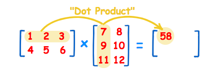
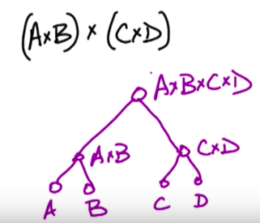
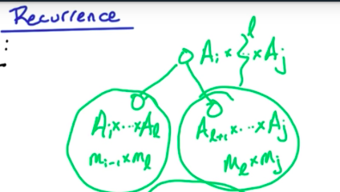

**Chain Matrix Multiply**

Input: 4 matrices A, B, C, D

Goal: Compute AxBxCxD most efficiently

*Example*

(1, 2, 3) • (7, 9, 11) = 1×7 + 2×9 + 3×11
    = 58

Number of rows in one matrix must be able to equal the number of columns
to be able to multiply matrices

When multiplying m x n matric by n x p matrix we get m x p matrix

AxBxCxD is associative - means (AxB)x(CxD) = (Ax(BxC))xD etc

Representation as a binary tree

Computational time is dependent on how many multiplications and
additions we have to do -> size od matrices

Recurrence

C(i,j) = min { C(i,l) + C(l,j) + m~i-1~m~2~m~j~: i <=l<=j-1}

C(i,l)--> left leg;
C(l,j)--> right leg

C(i,j) 0<=i<=j<=n - that's why we only consider top part of the matrix
above diagonal

i: beginning of the substring, j: end of substring