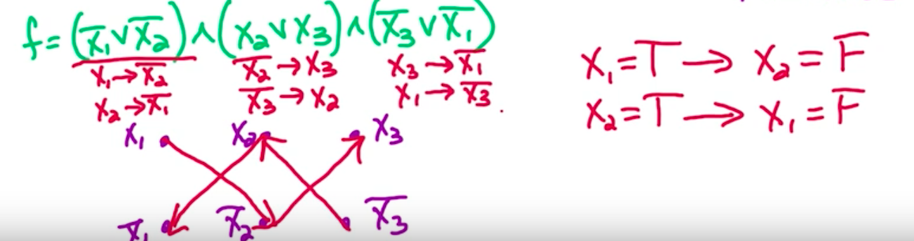

**SAT: notation**

Def

Boolean formula with n variables x~1~...x~n~

2 n literals x~1~, !x~1~, x~2~, !x~2~ etc

∧ (And)

∨ (Or)

CNF = Conjunctive Normal Form Clause: OR of several literals

Formula F in CNF is AND of n clauses

*SAT problem*

Input: Formula F in CNF with n variabls and m clauses

Output: Assignment (assign T or F to each variable) satysfying if one
exists, NO if no exists

k-SAT problem: clauses are of same max size k

2-SAT problem: Clauses are of max size 2. In particular, because we can
reduce all 1-size clauses we end up with all clauses having size
precisely 2.

*Graph of implications*

