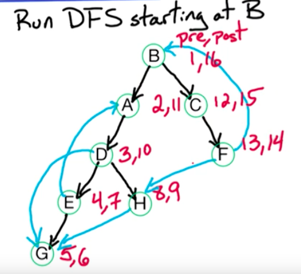
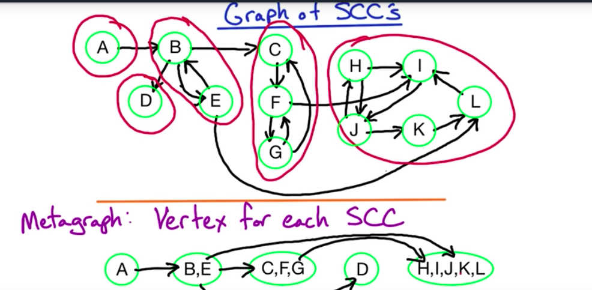

**Graph Algorithms**

DFS - depth search first = an algorithm for traversing searching tree or
graph data structures. The algorithm starts at the root node and
explores as far as possible along each branch before backtracking.

How to get connected components in undirected G?

- Run DFS and keep track of component number

DFS(G)

Input: G = (V, E) in adjacency list representation

Output: Vertices labelled by connected components

cc = 0

For all V∈V, visited(v) = false, previous(v) = null

If not visited(v) then Explore(v), cc++

Explore(Z)

ccnum(z) = cc

Visited(z) = true

For all (z,w) ∈E 

If not visited(w) then Explore(w), prev(W) = z

**DFS on directed graphs**

- We don't need to keep track of connected componnet number
- We keep track of pre-order and post-order numbers - number of when we
  visited the vertex

We have 4 different types of edges (forward, backward, tree, cross). For
all except back edge z -> w, postorder number (z) > postorder (w)

For back edges - opposite

**Cycles**

G has a cycle if DFS tree has a back edge

**Topological sorting**

DAG = directed acyclic graph

No cycles = no back edges

Topologically sorting a DAG = order vertices o that all edges go lower
-> higher. Run DFS on DAG G, for all z-> w We know post(z) > post(w) -->
order vertices by decreasing post number 

O(n+m)

Source vertex = no incomign edges = highest post order number

Sink vertex = no outgoing edges = lowet post order number

All DAGs have at least one source and one sink vertex

Alternative topological sorting algorithm:

1. Find a sink, output it and delete it
2. Repeat (1) until the graph is empty

For undirected graphs: connected component (or just a component) is a
subgraph in which any two vertices are connected to each other by paths

For directed graphs, strongly connected component = maximal set of
strongly connected vertices

Vertices are strongly connected if there is a path v->w and w->v (might
be many edges inbetween)

5 strongly connected components

**Each directed grapsh is a DAG of its SCCs** --> so we can order them topologically

*SCC algorithm idea*

Find sink SCC, output it, remove it & repeat

Finding sink SCC

For directed graph G = (V, E), look at G^R^ = (V, E^R^) = reverse of G

E^R^ = reverse of every edge in E 

sink SCC in G = source SCC in G^R^

**SCC algorithm**

Input: Directed G=(V,E)

1. Construct G^R^
2. Run DFS on G^R^
3. Order V by decreasing post order number
4. RUn undirected components algorithm
O(m+n)

Other algorithms that work on graphs - BFS (breadth fist search,
Dijkstra's - weighted graphs with all weights positive)

