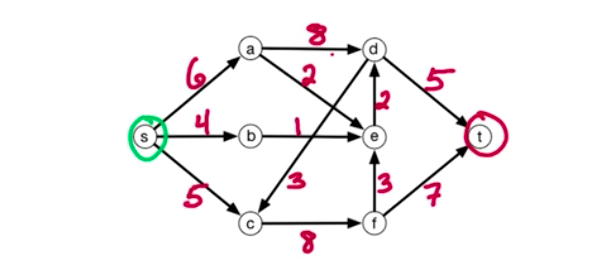
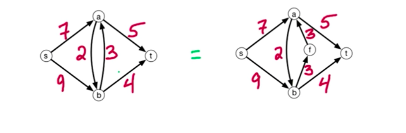

**Max-Flow problem**

Setting: Sending supply from vertex s to t

We want to maximise amount sent without exceeding edge capacities
(something like bandwith)

F~e~ = flow along e

Capacity contrainst: for all e ∈ E, 0 <= f~e~ <= c~e~

Conervation of flow: flow into v = flow out of v

Goal: Find a valid flow of maximum size

Size(f) = total flow sent = total flow out of s = flow into t

Cycles don't matter --> problem is well defined regardles of whether
there is a cycle or not.

Anti-pararrel edges - edges that go from one edge to another and vice
versa. We want to convert them to a graph without such edges.

*Residual network:*

- For existing edges, if there is anu unutilisez capacity, we create a
  vertex of residual capacity
- We add backwards vertices of a capacity of a flow (adding a
  possibility of reversing a vertex)

**Ford-Fulkerson algorithm**

1. St f~e~ = 0 for all e∈E
2. Build the residual network G' for the current flow f
3. Check for a path from s to t in G' (if no such path exists, output f)
4. Given P, let c(P) = min capacity along P in G'
5. Augment f by c(P) units along P
6. Repeat, until no such path

Running time --> we assume that all capacities are integers. Then flow
increases by > = unit per round. Let c = size of max flow. The <= c
rounds. O(mc)

*Lemma*

For flow f*, if there is no augmenting path in G*,then f* is a max flow

*S-t cut*

Input: flow network

Output: S-t-cut with min capacity

*Theorem*

Size of max-flow = min capacity of s-t cut

S-t Cut with min capacity = such a division of a graph to two sides L/R
so that cut from s to t is minimal (s and t have to be in different L/R parts)

