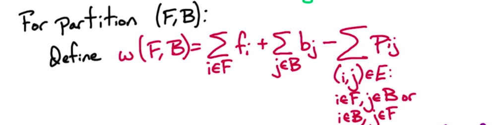
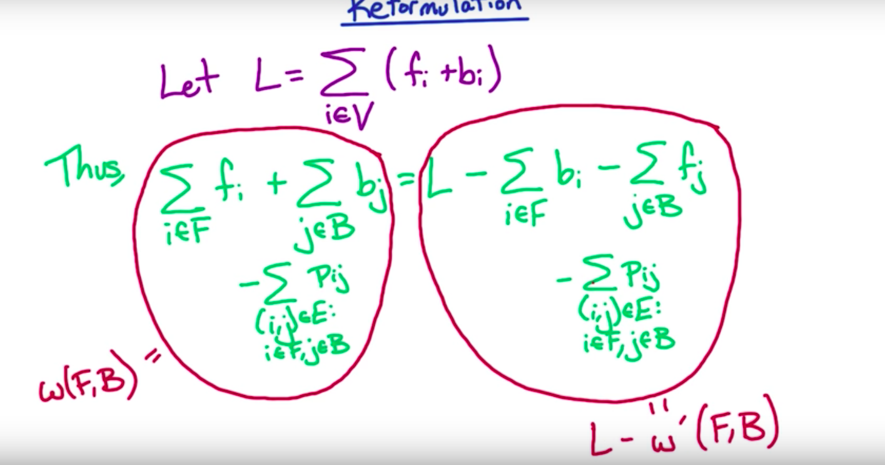
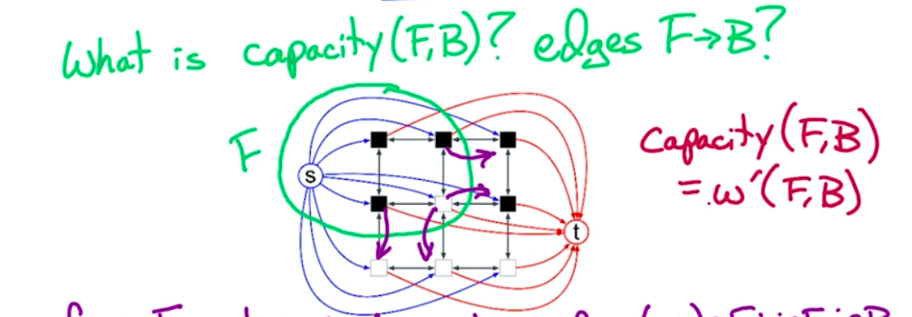

**Image Segmentation**

Formulation: View image on a graph

Input: Undirected G=(V,E)

V = pixels

E = edges between neighbouring pixels

f~i~ - likelihood that i is in foreground

b~i~ = likelihood that i is in background

f~i~ >= 0; b~i~ >= 0

For each (i,j) ∈ E

P~ij~ = separation penalty = the cost of separating i and j into
different objects

P~ij~ >-= 0

**Partition**

Partition V into V = F ∪ B

For partition (F, B)

Goal: Find partition(F,B) with max w(F,B)

*Reformulation*

max w(F,B) = min w'(F,B)

We redefined the maximisation problem to directed graph (to reduce the
problem into the flow network problem)

We addd edges in both direction i->j, j-. i, with capacities P~ij~

Edges from s yo vertices = weights are the likelihood of being in the background

Edges from t - likelihood of being in the background

Sum of all weights on edges going from F is w'

Capacity(F,B) = w'(F,B) --> min cut problem

*Solution*

Givrn input G, f, b, p

for image segmentation, define network G',c & get flow f* of max size

Size f* = capacity of min s-t cut = min w'(F,B)

max w(F,B) = c - min* w'(F,B)

